  <h1>🌟 SINTONIA</h1>
  <h3>Piattaforma Digitale Integrata per il Supporto alla Salute Mentale</h3>
  

    <em>Ottimizzazione delle liste d'attesa e supporto proattivo per il Sistema Sanitario Regionale della Campania.</em>
  

  
  

    <a href="#-il-team">Il Team</a> •
    <a href="#-visione-del-progetto">Visione</a> •
    <a href="#-anteprima-dellapplicazione">Gallery</a> •
    <a href="#-architettura-di-sistema">Architettura</a> •
    <a href="#-algoritmi-chiave">Algoritmi</a> •
    <a href="#-scelte-tecnologiche">Tech</a>
  

---

## 👥 Il Team

SINTONIA è sviluppato con passione dal team **C09** dell'Università degli Studi di Salerno.

 

### Project Manager

*   <a href="https://github.com/gianfrancobarba"> **Gianfranco Barba**</a>

*   <a href="https://github.com/FCorcione02"> **Francesco Corcione**</a>

### Developers

*   <a href="https://github.com/gianlucaam"> **Gianluca Ambrosio**</a>

*   <a href="https://github.com/elesshhhh"> **Elena Carlomagno**</a>

*   <a href="https://github.com/rosx3"> **Rosaria Cervino**</a>

*   <a href="https://github.com/KekkoCoppola"> **Francesco Coppola**</a>

*   <a href="https://github.com/AntonioWalter"> **Antonio Walter De Fusco**</a>

*   <a href="https://github.com/Gav798"> **Gavino De Stefano**</a>

*   <a href="https://github.com/aleds25"> **Alessio Del Sorbo**</a>

*   <a href="https://github.com/franci1313"> **Francesco Di Giovanni**</a>

*   <a href="https://github.com/mattFanz"> **Mattia Fanzini**</a>

*   <a href="https://github.com/af21-code"> **Angelo Fusco**</a>

*   <a href="https://github.com/GiaPol"> **Gianni Policola**</a>

---

## 📖 Visione del Progetto

**SINTONIA** non è solo un gestionale, ma un **ecosistema proattivo** che trasforma il paradigma della salute mentale pubblica: da *reattiva* (aspetto che il paziente stia male) a *predittiva* (intervengo prima della crisi).

Il sistema integra **algoritmi di triage dinamico** e strumenti di **monitoraggio continuo** per garantire che nessun paziente si senta abbandonato durante l'attesa. L'obiettivo è azzerare il "buco nero" assistenziale tra la richiesta di aiuto e la prima visita, fornendo supporto immediato tramite tecnologia accessibile.

---

## 🆚 Il Problema vs La Soluzione

Ecco come SINTONIA cambia le regole del gioco rispetto al sistema tradizionale (ASL).

<table>
  <thead>
    <tr>
      <th width="45%" align="center">🚫 Situazione Attuale (ASL)</th>
      <th width="10%" align="center"></th>
      <th width="45%" align="center">✅ Innovazione SINTONIA</th>
    </tr>
  </thead>
  <tbody>
    <tr>
      <td>
        <strong>Soggetta a Staticità</strong> 
        Il paziente riceve una "etichetta" di priorità all'inizio che rimane invariata per mesi, ignorando peggioramenti.
      </td>
      <td align="center">➡️</td>
      <td>
        <strong>Triage Dinamico e Vivo</strong> 
        La priorità si aggiorna <em>in tempo reale</em> ad ogni questionario. Se il paziente peggiora, scala la coda automaticamente.
      </td>
    </tr>
    <tr>
      <td>
        <strong>Vuoto Assistenziale</strong> 
        Silenzio totale per mesi. Il paziente è solo con i suoi pensieri in attesa della chiamata.
      </td>
      <td align="center">➡️</td>
      <td>
        <strong>Supporto H24</strong> 
        Strumenti di <em>self-help</em> (Diario, Monitoraggio Umore) e una Community anonima offrono supporto immediato fin dal primo giorno.
      </td>
    </tr>
    <tr>
      <td>
        <strong>Rischio Invisibile</strong> 
        Ideazioni suicidarie o crisi acute passano inosservate nel "mucchio" cartaceo.
      </td>
      <td align="center">➡️</td>
      <td>
        <strong>Alert Predittivi</strong> 
        Il sistema rileva *pattern semantici* a rischio (es. parole chiave nel diario) e notifica istantaneamente lo psicologo.
      </td>
    </tr>
  </tbody>
</table>

---

## 🔬 Algoritmi Chiave

La logica "intelligente" di SINTONIA risiede nei suoi algoritmi clinici avanzati.

### Calcolo Score Paziente (Exponential Decay)

Il sistema utilizza un modello matematico a **decadimento esponenziale** per calcolare il rischio clinico. Questo garantisce che gli eventi recenti abbiano più peso, senza però "dimenticare" la storia clinica del paziente (peso minimo garantito 20%).

La formula utilizzata per il calcolo del peso temporale $w(t)$ è:

$$ w(t) = \max(e^{-\lambda \cdot t}, 0.20) $$

Dove:
*   $t$ è il numero di giorni trascorsi dalla compilazione.
*   $\lambda$ è il coefficiente di decadimento, calcolato dinamicamente per ogni tipo di questionario in base alla sua frequenza clinica (es. PHQ-9 ogni 14gg).

```mermaid
graph LR
    A[Screening Periodico] --> B{Decadimento<br>Esponenziale}
    B -->|Pesi Ricalcolati| C[Score Rischio Attuale]
    C -->|Override Manuale?| D{Triage Engine}
    D -->|Si| E[Priorità Forzata]
    D -->|No| F[Coda Dinamica]
```

### Coda Prioritaria Dinamica

L'assegnazione è basata su **Finestre Temporali di Intervento**:

| Fascia Priorità | Score Rischio | Target Intervento |
|:---|:---:|:---:|
| 🔴 **Urgente** | 80 - 100 | **3 giorni** |
| 🟠 **Breve** | 60 - 79 | **10 giorni** |
| 🟡 **Differibile** | 40 - 59 | **30 giorni** |
| 🟢 **Programmabile** | 0 - 39 | **120 giorni** |

---

## 🏗 Architettura di Sistema

SINTONIA è costruito su un'architettura **Three-Tier** robusta e scalabile.

### ⚡ Tech Stack

| Area | Tecnologie | Dettagli |
|:---:|:--- |:---|
| **Frontend** |    | SPA moderna reattiva (Web + Mobile PWA). |
| **Backend** |   | Framework server-side scalabile e modulare. |
| **Data** |   | DBMS relazionale e ORM type-safe. |
| **Infra** |   | Orchestrazione containerizzata e Monorepo. |

---

## ✨ Funzionalità per Ruolo

### 👤 Per i Pazienti (App Mobile)
*   **Questionari Clinici Standardizzati**: Compilazione test periodici (PHQ-9, GAD-7, WHO-5) per il monitoraggio continuo.
*   **Diario Emotivo**: Spazio personale sicuro per registrare pensieri e stati d'animo giornalieri.
*   **Gamification**: Sistema di badge e obiettivi (es. "3 giorni consecutivi") per incentivare la costanza nel percorso.
*   **Forum Anonimo**: Community moderata dove confrontarsi con altri pazienti o porre domande in totale privacy.
*   **Profilo Personale**: Gestione dei propri dati e visualizzazione del proprio andamento storico.

### 🧑‍⚕️ Per gli Psicologi (Web Dashboard)
*   **Triage Intelligente**: Visualizzazione immediata della lista d'attesa ordinata per priorità clinica reale.
*   **Alert System**: Notifiche push in caso di peggioramento dei parametri vitali del paziente.
*   **Revisione**: Strumenti per analizzare nel dettaglio le risposte ai questionari e prendere decisioni infomate.
*   **Gestione Ciclo di Cura**: Funzionalità di presa in carico, monitoraggio e chiusura trattamento.

### 👨‍💼 Per gli Amministratori (Web Admin)
*   **Gestione Utenza**: Creazione e gestione anagrafiche per Psicologi e Staff.
*   **Supervisione Code**: Panoramica globale sui tempi di attesa e carichi di lavoro.
*   **Moderazione**: Controllo dei contenuti segnalati nel Forum per garantire un ambiente sicuro.

---

## 📂 Documentazione

> [!NOTE]
> La documentazione completa del progetto, incluse le guide utente e i manuali di installazione, è attualmente in fase di revisione e sarà disponibile a breve.

---

## 🗺️ Roadmap Futura

- [ ] **App Mobile Nativa**: Migrazione a React Native.
- [ ] **Suddivisione Territoriale**: Gestione code multiple per ASL.
- [ ] **Telemedicina**: Videochiamate in-app criptate.

---

  
  
  

  Copyright © 2025 SINTONIA. All rights reserved.

